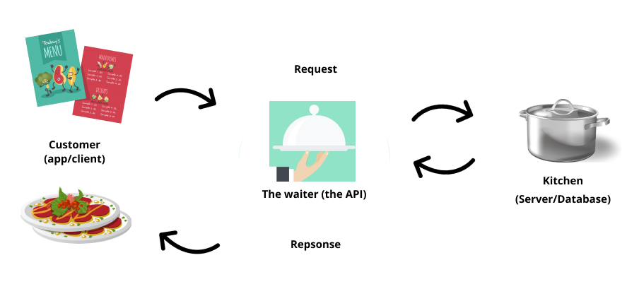

# Parte 2 - Practical Kindom
*Nuestro héroe perfecciona sus habilidades y triunfa sobre el desafío* 

## 1. Actividad Práctica: Analizando un archivo cargado por usuario

Completar el archivo `pages/01_📃_Archivo.py` para que, usando la librería pandas y matplotlib, permita:
- [ ] Cargar un archivo csv y leerlo pudiendo seleccionar el tipo de encoding y el separador.
- [ ] Mostrar las primeras 10 líneas cargadas del archivo.
- [ ] Indicar el número de columnas y filas del archivo.
- [ ] Indicar para cada columna el nombre de la columna, el número de valores distintos, el valor más frecuente, el número de valores nulos y el porcentaje de valores nulos.
- [ ] Seleccionar 1 columna y realiza un histograma de los valores.

En `./datasets/` existen 2 datasets para testear la actividad: [`ExhaustiveDinosaurDataset.csv`](https://www.kaggle.com/datasets/kjanjua/jurassic-park-the-exhaustive-dinosaur-dataset) y [`CoffeeQuantityDataset.csv`](https://www.kaggle.com/datasets/volpatto/coffee-quality-database-from-cqi).

## 2. Session State

Lorem Ipsum

## 3. Secrets

Lorem Ipsum

## 4. Query parameters
- get_query_params
- set_query_params

## 5. Optimization

st.cache

## 6. Streamlit components

Lorem Ipsum

- Donde buscar. 
- Ejemplos: ¿camara yuihiro?

## 7. Actividad Práctica: Consumiendo un API
Una API es una mecanismo de conectarse con un computador y lograr que haga cosas: entregar información (método GET), recibir información (método POST), etc.

{:height="400px"}

Algunos ejemplos de API:
* [dog.ceo](https://dog.ceo/dog-api/documentation/): API de perros (gratuita, abierta).
* [thecatapi](https://thecatapi.com/): API de gatos (pagada, requiere registro).
* [catfact](https://catfact.ninja/): API de gatos (gatuita 🤣, abierta).
* [api.nasa.gov](https://api.nasa.gov/): Api de la NASA (gratuita, requiere registro).
* [funtranslations](https://funtranslations.com/api/): API de traducciones (gratuita, abierta).
* [pokeapi](https://pokeapi.co/): API de pokemones (gratuita, abierta).
* [dinoipsum](https://dinoipsum.com/): API para generar texto de dinosaurios (gratuita, abierta).
* [dinosaur-facts-api](https://dinosaur-facts-api.shultzlab.com/): API para obtener datos de dinosaurios (gratuita, pública).
* [imgur api](https://apidocs.imgur.com/): API de Imgur (gratuita, requiere registro).
* [giphy api](https://developers.giphy.com/explorer): API de Giphy (gratuita, requiere registro).
* [github api](https://api.github.com/): API de Github (gratuita, requiere registro).
* [spotify api](https://developer.spotify.com/documentation/web-api/): API de Spotify (gratuita, requiere registro).
* [A Curated List of 100 Cool and Fun Public APIs to Inspire Your Next Project](https://betterprogramming.pub/a-curated-list-of-100-cool-and-fun-public-apis-to-inspire-your-next-project-7600ce3e9b3)
* [25 Crazy APIs For Your Next Project](https://blog.snap.hr/24/09/2018/25-crazy-apis-next-project/)
* [7 cool APIs you didn't know you needed](https://www.twilio.com/blog/cool-apis)

En esta actividad, completaremos la información de la pagina web con información que obtendremos una API.
La API que usaremos es la de [dog.ceo](https://dog.ceo/dog-api/documentation/). 

Editar el archivo `pages/02_🌐_API.py` para que:

- [ ] Obtenga una lista de todas las razas de perros.

- [ ] Permita al usuario seleccionar una raza específica.

- [ ] Muestre una foto al azar de un perro de esa raza.

- [ ] Muestre una foto de cada una de las subrazas, si existen.

## 8. Seguir aprendiendo

Consejos:
* No aprender sólo por saber. Buscar un proyecto apasionante, y aprender en lla medida que se necesita. ¡Hay que tirarse a la piscina!
* Seguir el desafío: "[30 días de Streamlit](https://share.streamlit.io/streamlit/30days)"

{:height="250px"}

Comunidades:
* Foro Oficial: https://discuss.streamlit.io/
* Discord: https://discord.com/invite/bTz5EDYh9Z

📖 Libros:
* Getting Started with Streamlit for Data Science, de Tyler Richards

Twitter:
* Streamlit: @streamlit
* Fanilo Andrianasolo: @andfanilo
* Charlie Wargnier: @DataChaz
* JM Napoles: @napoles3D